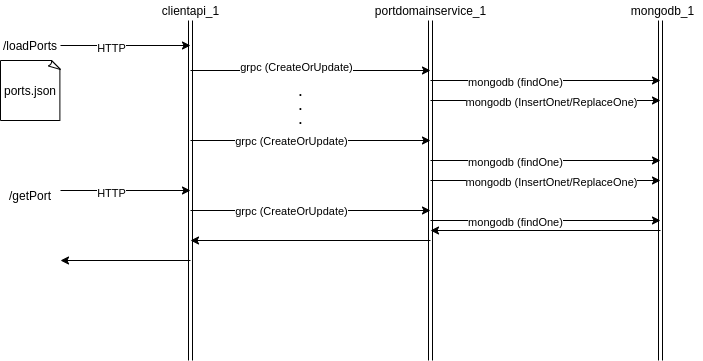

# ports-microservices

## Requirements
- docker (tested on 20.10.13)
- docker-compose (tested on v2.3.3)
- curl (tested on 7.79.1)
- protobuf (`brew install protobuf`)
- protoc-gen-go (`brew install protoc-gen-go`)
- protoc-gen-go-grpc (`brew install protoc-gen-go-grpc`)

## Idea
Project contains two microservices made with Go.

First container (clientAPI) handles REST interface that allows to load ports data from json file and get port from database.
ClientAPI also sends gRPC requests to second container - portDomainService - with requests to create (or update) port entry in database or retrieve port data from database.

portDomainService handles gRPC requests from clientAPI and make requests to mongoDB database located within dedicated mongoDB database container.




Hexagonal architecture of microservices:

**NOTE:** Hexagonal architecture made as described in [this](https://medium.com/@matiasvarela/hexagonal-architecture-in-go-cfd4e436faa3) article.

## Protoc generate
```
protoc --go_out=pkg/portsprotocol --go_opt=paths=source_relative --go-grpc_out=pkg/portsprotocol --go-grpc_opt=paths=source_relative ./pkg/portsprotocol/ports.proto
```

## Build the containers
docker-compose builds clientAPI and portDomainService containers from Go code packages.

`docker-compose build`
or simply:
`make build`

## Create all containers
docker-compose creates a clientAPI, portDomainService and mongoDB containers that have a fixed domain name (used to handle static networking instead of looking fo dynamic IP each time). Containers communitate between each other and also clientAPI REST API is reachable from localhost.

`docker-compose up`

**NOTE:** When editing the code add `--force-recreate` flag to make sure that docker-compose uses the latest version of containers

or simply:
`make run`

## Post ports file via REST interface
This command is an example of using clientAPI REST API for loading ports data from JSON file.

`curl -F file=@ports.json 'http://127.0.0.1:8000/loadPorts'`

## Getting port via REST interface
This command is an example of gathering port data using clientAPI REST API. (`ZWUTA` is an example key from ports.json test file attached in this repo. Feel free to use any other key.)

`curl -X POST -H "Content-Type: application/json" -d '{"key": "ZWUTA"}'  'http://127.0.0.1:8000/getPort'`
